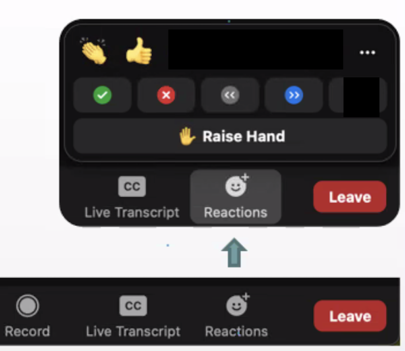

```{r xaringan-themer, include=FALSE, warning=FALSE}
library(xaringanthemer)
style_mono_accent(
  base_color = "#1c5253",
  header_font_google = google_font("Josefin Sans"),
  text_font_google   = google_font("Montserrat", "300", "300i"),
  code_font_google   = google_font("Fira Mono"),
  colors = c(
    red = "#f34213",
    purple = "#3e2f5b",
    orange = "#ff8811",
    green = "#136f63",
    white = "#FFFFFF"
  )
)

```

```{r, include=FALSE, warning=FALSE, message=FALSE}
library(tidyverse)
library(lubridate)
library(janitor)
library(kableExtra)
library(rgdal)
```

# Welcome!

* Instructor: **Anjali Silva**, PhD

* Researcher and Lecturer, Department of Cell & Systems Biology, U of T

* Data Analyst, University of Toronto Libraries 

* Pronouns: she/her

* Name Phonetic: Un-j-li Sil-va

* Email: a.silva@utoronto.ca (Must use the subject line DSI-IntroR. E.g., DSI-IntroR: Inquiry about Lecture I.)

---

# Welcome!

* Teaching Assistant: **Tia Harrison**, MSc; PhD Candidate

* Department of Ecology and Evolutionary Biology

* Pronouns: she/her

* Name Phonetic: T-ee-ah

* Email: tia.harrison@mail.utoronto.ca

---

# Description

This course is designed for students who have a degree in something other than Computer Science/Statistics who are looking to enhance their data science skills for their career. The first part of this course teaches R with a focus on manipulating and visualizing data. Students will get set up with a functional RStudio workflow, use different file types, transform data tables, import and manipulate data, use functions and loops, create data visualizations, make a Shiny app, and learn how to solve problems with their programming. Both base R and tidyverse methods are taught. To work reproducibly, students will create R Projects.

---

# Learning Outcomes

* Setting up and using R and RStudio.
* Manipulating and visualizing data.
* Fixing errors.
* Understanding consent in data-based studies.
* Making presentations and managing projects.

---

# Delivery Instructions

The course will be held over a period of 2 weeks, with classes taking place 3 days a week. Format will be online - synchronous via Zoom. Students must have internet connection and a computer with a microphone and required sofware implemented in order to participate. Keep microphones muted, unless you need to speak. Please indicate your name before speaking. Keeping your video on is optional, however, if you choose to leave it on, be mindful of what your peers can see. Course communications will take place via email. All course material will be available via IntroductionToR GitHub repository (https://github.com/anjalisilva/IntroductionToR). Folder structure is as follows:
   * Lessons - All files*: These folders contain all files.
   * **Lessons - Data only**: This folder contains data only.
   * **Lessons - Lesson Plans only**: This folder contains lesson plans only.
   * **Lessons - PDF only**: This folder contains slide PDFs only.
   * README - README file
   * .gitignore - Files to ignore specified by instructor

---

# Prerequisite knowledge

- The parts of a data table/spreadsheet
- Basics of file folder structure
- Summary statistics (mean, median, proportion, etc.)
- Basic data visualization types (bar charts, histograms, scatter plots)
- GitHub account

---

# Submodules

- Hello World!
- Errors
- Reproducibility
- Data in R
- Manipulation
- Wrangling
- Programming
- Visualization
- Shiny (optional)

---

# Key Texts

### General reference:

R for Data Science by Wickham and Grolemund (2017) https://r4ds.had.co.nz/index.html

DoSS Toolkit (2021) https://rohanalexander.github.io/doss_toolkit_book/. 

---

# Key Texts

### For specific topics:

 * Alexander, 2022, *Telling Stories with Data*, CRC Press. https://www.tellingstorieswithdata.com/ 
    * Alexander (eds), 2021, *DoSS Toolkit*, https://rohanalexander.github.io/doss_toolkit_book/. 
    * de Graaf, 2019, *Managing Your Data Science Projects: Learn Salesmanship, Presentation, and Maintenance of Completed Models*, Apress.
    * Healy, 2018, *Data Visualization*: A Practical Introduction, Princeton University Press
    * Timbers et al., 2021. *Data Science: A First Introduction*. https://ubc-dsci.github.io/introduction-to-datascience/ 
    * Wickham and Grolemund, 2017, *R for Data Science*, O'Reilly. https://r4ds.had.co.nz/ 
    * Wickham, 2021, *Mastering Shiny*, O'Reilly. https://mastering-shiny.org/ 
    * Wiley, Matt, Wiley, Joshua F., 2020, *Advanced R 4 Data Programming and the Cloud*
    * *Using PostgreSQL, AWS, and Shiny*, Apress.
---

# Materials

* Learners must have internet connection and a computer with a microphone in order to participate in online activities. 

* Learners must have R (http://www.r-project.org/).

* Learners must have RStudio (http://www.rstudio.com/).

* Screen space can be a limitation during online learning since you'll want to see the instructor's screen and have your RStudio open so that you can type along. If you have access to a second monitor or a larger tablet to attend the course while keeping your laptop screen available for coding - this would be great! If not - don't worry, we'll manage!

---

# Course Expectations

```{r fig.align="center", fig.cap='Figure: Zoom ‘Reactions’ that you may use.', echo=FALSE, out.height=250, out.width= 400}

```

---

# Course Expectations

```{r fig.align="center", fig.cap='Figure: It is recommended that windows are resized so that both the user RStudio window and Instructor Zoom window (with RStudio) is visible at the same time. User may collapse panels of their RStudio not in current use.', echo=FALSE, out.height=350, out.width= 800}
knitr::include_graphics("ScreenSplit.png")
```

---

## Tentative Schedule
*Calendar may be modified as needed, and learners will be informed. Course will be taught using R version 4.2.0 and RStudio Desktop version 2022.02.2.

* Monday 27 June, 6pm-8pm EST
      * Introduction, Hello World! And Work practices 
* Thursday 30 June, 6pm-8pm EST
      * Data in R 
* Saturday 2 Jul, 9am-noon EST
      * Manipulation
* Monday 4 July, 6pm-8pm EST
      * Wrangling 
* Thursday 7 July, 6pm-9pm EST
      * Programming
* Saturday 9 July, 9am-noon EST
      * Visualization (optional Shiny)

---
# Course Policies

## Course Expectations
-   The course will include mainly live-coding classes. Students are expected to follow along with the coding. Be mindful of online fatigue. Be respectful and only one speaker at a time. Keep yourself on mute, unless you need to speak or ask a question. If you have a question, use raise hand feature. First say your name, then ask the question. If you have a question, you may type it to chat as well.

-   Students with diverse learning styles and needs are welcome in this course. We are dedicated to providing an accessible learning environment for all. Please notify in advance of the course start date if you require any accommodations or if there is anything we can do to make this workshop more accessible to you. 

---

# Acknowledgements
-   Slides covered in the lectures were originally developed by Amy Farrow under the supervision of Rohan Alexander, University of Toronto. Slides have been modified by Anjali Silva for 2022. 

---

class: inverse, center, middle

# Any questions?

---

# Data Science Tools 

```{r fig.align="center", fig.cap='Figure: KDnuggets Survey of Machine Learning Software that asked respondents which data science tools they had used for projects within the past year. The x-axis shows the proportion of users who used a particular data science tool within the past year. Figure from https://www.kdnuggets.com/2020/06/ data-science-tools-popularity-animated.html',  echo=FALSE, out.height=300, out.width= 450}
knitr::include_graphics("DataScienceTools.png")
```

---
# Data Science Skills 

```{r fig.align="center", echo=FALSE, out.height=350, out.width= 400}
knitr::include_graphics("DataScienceSkills.png")
```

---

class: inverse, center, middle

# R

---

# What is R?

* A language and environment for statistical computing and graphics.

* R was initially written by Ross Ihaka and Robert Gentleman.

* Since mid-1997, the R Core Team modify the R source.

* R runs on a wide variety of UNIX platforms, Windows and MacOS.

* R is designed with interactive data exploration in mind.

* A version of R is released each year. Current release is 4.2.0.

## Further Reading 

*  Ihaka,R. and Gentleman,R. (1996) R: a language for data analysis and graphics. *J. Comput. Graph. Statist.*, 5, 299–314.

---

# Why R?

* R is open source and free.

* R has a community.

* With R, you can share your data analysis methods in a reproducible way.

* Packages (more than 18 thousand on CRAN!) extend R's capabilities to provide easy ways to accomplish a wide variety of tasks.

* R is one of the standard language recommendations for data science.

* RStudio makes it easier to do more with R.

---

class: inverse, center, middle

# RStudio

---

# RStudio

* RStudio is an integrated development environment R.

* Not only for R, but can also use Python.

* Has:
    * A console
    * Syntax-highlighting editor for code execution
    * Tools for plotting, viewing history, debugging and workspace management
    
* RStudio contains many features that make the development process easier and faster.

---
# Options To Work With R

```{r fig.align="center", fig.cap='Figure: Some options to work with R. Several other options are present including the Jupyter Notebook.', echo=FALSE, out.height=350, out.width= 600}
knitr::include_graphics("RWorkingOptions.png")
```

---
# Options To Work With R

```{r fig.align="center", echo=FALSE, out.height=250, out.width= 400}
knitr::include_graphics("Analogy.png")
```

---

class: inverse, center, middle

# Any questions?

---

class: inverse, center, middle

# What can you do with R?

---

## Load data 

```{r, include=FALSE, warning=FALSE, message=FALSE}
apt_data <- read_csv("Apartment Building Evaluation.csv")
```

```{r, warning=FALSE, message=FALSE, echo=FALSE}
apt_data %>%
  select(YEAR_BUILT, YEAR_EVALUATED, LONGITUDE, LATITUDE, SCORE)
```

---

## Clean data

```{r, warning=FALSE, message=FALSE, echo=FALSE}
apt_data_clean <- apt_data %>%
  clean_names()
apt_data_clean %>%
  select(year_built, year_evaluated, longitude, latitude, score)
```

---

## Manipulate and combine data

```{r, warning=FALSE, message=FALSE, echo=FALSE}
assault_data <- read_csv("Assault.csv")
```

```{r, warning=FALSE, message=FALSE, echo=FALSE}
apt_data_clean <- apt_data_clean %>%
  mutate(coords = paste0("(", round(latitude, digits = 2), ",", round(longitude, digits = 2), ")")) %>%
  mutate(year = year_evaluated) %>%
  filter(year != 2021)

assault_data <- assault_data %>%
  mutate(coords = paste0("(", round(Lat, digits = 2), ",", round(Long, digits = 2), ")"))
```

```{r, warning=FALSE, message=FALSE, echo=FALSE}
assault_summary <- assault_data %>%
  mutate(year = str_sub(occurrencedate, 1, 4)) %>%
  group_by(coords, year) %>%
  summarise(count = n()) %>%
  mutate(year = as.numeric(year))
```

```{r, warning=FALSE, message=FALSE, echo=FALSE}
joined_data <- left_join(apt_data_clean, assault_summary, by = c('coords', 'year')) %>%
  mutate(count = replace_na(count, 0))
```

```{r, warning=FALSE, message=FALSE, echo=FALSE}
joined_data %>%
  select(year_built, property_type, confirmed_units, score, year, count)
```


---

## Summarize Data

```{r, warning=FALSE, message=FALSE, echo=FALSE}
apt_data_clean %>%
  group_by(ward) %>%
  summarise(`Count` = n(),
            `Average Score` = mean(score),
            `Median Year Built` = median(year_built, na.rm=TRUE),
            `Median Number of Storeys` = median(confirmed_storeys),
            `Median Number of Units` = median(confirmed_units)) %>%
  slice(1:10) %>%
  kable()
```


---

## Visualize Data

```{r, warning=FALSE, message=FALSE, echo=FALSE, include=FALSE}
ward_summaries <- joined_data %>%
  group_by(ward) %>%
  summarise(med_score = median(score),
            med_assault = median(count))

left_join(joined_data, ward_summaries, by = 'ward') %>%
  mutate(ward = as.factor(ward)) %>%
  filter(year == 2019) %>%
  ggplot() +
  geom_boxplot(aes(x = ward, y = count, fill = med_score)) +
  scale_fill_continuous(low = "red", high = "blue") +
  labs(x = "Ward",
       y = "Number of assaults reported in building",
       fill = "Median\nbuilding\nevaluation\nscore",
       title = "Apartment building evaluation scores and reported assaults in 2019") +
  theme_minimal()
```

```{r, warning=FALSE, message=FALSE, echo=FALSE, include=FALSE}
type_summaries <- joined_data %>%
  filter(year == 2019) %>%
  group_by(property_type) %>%
  summarise(med_score = median(score),
            med_assault = median(count))

left_join(joined_data %>% filter(year == 2019), type_summaries, by = 'property_type') %>%
  ggplot() +
  geom_violin(aes(x = property_type, y = count, fill = med_score)) +
  scale_fill_continuous(low = "red", high = "blue") +
  labs(x = "Type of housing",
       y = "Number of assaults reported in building",
       fill = "Median\nbuilding\nevaluation\nscore",
       title = "Apartment building evaluation scores and reported assaults in 2019") +
  theme_minimal()
```


```{r, fig.width=10, fig.height=7, warning=FALSE, message=FALSE, echo=FALSE}
joined_data %>%
  filter(year == 2019) %>%
  ggplot(aes(x = score)) +
  geom_histogram(bins = 20) +
  facet_wrap(vars(property_type),
             ncol = 1,
             scales = 'free_y') +
  labs(x = "Building evaluation score",
       y = NULL) +
  theme_minimal()
```

---

## Write Reports

```{r echo=FALSE, out.height=450, out.width= 2000}
knitr::include_graphics("sample_paper.png")
```

---

## Build Interactive Applications

```{r echo=FALSE, out.height=450, out.width= 2000}
knitr::include_graphics("sample_app.png")
```

---

# And more:

- Data collection
- Statistical analysis
- Data modeling
- Presentations
- Websites

---

# Hello World!

**.purple[(Beginner)]**

How can we start using R?

## Goals:

- a fully-functional R and RStudio setup
- understanding and using parts of the RStudio IDE
- run basic commands in R
- creating and using different R file types for different purposes

---

# Hello World!

Getting set up

- R
- RStudio

--

R basics

```{r, eval=FALSE}
(27 / 52) * 100
object_name <- value
function(arguments)
```

--

File types

- scripts
- RMarkdown

---

# Errors

**.purple[(Beginner)]**

How can we avoid getting stuck on errors while using R?

## Goal:

- Functional problem-solving abilities for learning and using R

---

# Errors


Getting help

--

Using Stack Overflow

--

Making reproducible examples

---

# Reproducibility

How does R help us work reproducibly?

## Goal:

- Use an RProject and GitHub to make your data analysis project reproducible
- Understand coding conventions

---

# Data in R

**.purple[(Beginner)]**

What does data look like in R?

## Goals:

- Know what data.frames, tibbles, and tidyverse are
- Understand key types of data, including strings, ordered factors, and dates and times
- Understand how R handles missing values

---

# Data in R

Tidyverse

```{r, eval=FALSE}
library(tidyverse)
```

--

Tibbles

```{r, eval=FALSE}
tibble()
```

--

Strings

```{r, eval=FALSE}
"This is a string"
```

--

Factors

```{r, eval=FALSE}
factor(vector, levels)
```

---

# Data in R

Dates and times

```{r, eval=FALSE}
library(lubridate)
```

--

Missing values

```{r, eval=FALSE}
NA
```

---

# Manipulation

**.purple[(Beginner)]**

How can we manipulate data tables in R?

## Goals:

- View subsets of data tables
- Pick specific variables
- Create new variables
- Group observations by traits
- Summarise groups of observations
- Order data tables

---

# Manipulation

Filtering

```{r, eval=FALSE}
filter()
```

--

Arranging

```{r, eval=FALSE}
arrange()
```

--

Selecting

```{r, eval=FALSE}
select()
```

--

Mutating

```{r, eval=FALSE}
mutate()
```

---

# Manipulation

The pipe

```{r, eval=FALSE}
%>%
```

--

Grouping

```{r, eval=FALSE}
group_by()
```

--

Summarizing

```{r, eval=FALSE}
summarise()
```

- Counting
- Proportions

---

# Wrangling

**.purple[(Intermediate)]**

How can we work with real data sets in R?

## Goals:

- Load data tables into R
- Connect related but separate data tables
- Load data from an external database
- Work efficiently with larger data sets

---

# Wrangling

Importing data

```{r, eval=FALSE}
read_csv()
```

--

Interacting with databases

```{r, eval=FALSE}
library(RPostgreSQL)
```

--

Cleaning

```{r}
library(janitor)
```

--

Pivot

```{r, eval=FALSE}
pivot_longer(), pivot_wider()
```

---

# Wrangling

Joining data

```{r, eval=FALSE}
left_join(), right_join(), full_join(), inner_join()
```

--

data.table

```{r, eval=FALSE}
library(data.table)
```

---

# Programming

**.purple[(Intermediate)]**

How can we use programming concepts like iterators to enhance our work in R?

## Goals:

- Write functions in R to perform custom operations
- Perform operations iteratively
- Perform operations given specific conditions
- Understand and use vectors in functions and loops
- Make data sets for simulation studies

---

# Programming

Functions

```{r, eval=FALSE}
name <- function(x) {
  
}
```

--

Vectors

```{r, eval=FALSE}
c(), list()
```

--

Loops

```{r, eval=FALSE}
for (i in 1:10) {
  
}

while (i < 10) {
  
}
```

---

# Programming

If/else logic

```{r, eval=FALSE}
if (x = 3) {
  
} else {
  
}
```

--

Simulation

```{r, eval=FALSE}
set.seed(), runif(), rnorm(), sample()
```

---

# Visualization

**.purple[(Intermediate)]**

What kinds of visualizations can we make in R?

## Goals:

- Make communicative and visually-pleasing bar graphs, histograms, and scatterplots 

---

# Visualization

Essentials

```{r, eval=FALSE}
ggplot(aes())
```

--

Bar charts and histograms

```{r, eval=FALSE}
geom_bar(), geom_histogram()
```

--

Scatter plots

```{r, eval=FALSE}
geom_point(), geom_smooth()
```

---

# Shiny (optional)

**.purple[(Advanced)]**

How can we make interactive applications using R?

## Goal:

- Make a basic functional Shiny application to display a data visualization

---

# Shiny (optional)

```{r, eval=FALSE}
library(shiny)
ui <- fluidPage(
  "Hello, world!"
)
server <- function(input, output, session) {
}
shinyApp(ui, server)
```

## Examples:
Visit: https://shiny.rstudio.com/gallery/


---

class: inverse, center, middle

# Any questions?

---

# Ethics (not covered)

Why does consent matter in data-based studies?

## Goal:

- Understand the necessity and complexity of consent for data-based studies

---

# Ethics (not covered)

James H. Ware, 1989, ‘Investigating Therapies of Potentially Great Benefit: ECMO’, Statistical Science.

Donald A. Berry, 1989, ‘Comment: Ethics and ECMO’, Statistical Science.

---

# Inequity (not covered)

How can we undertake is Equity, Diversity, and Inclusion training?

## Goal: 

- Understand Equity, Diversity, and Inclusion (EDI) training

---

# Professional skills (not covered)

## Goals:

- Presenting data analysis results
- Managing data projects
- Data security

---

# Industry case study (not covered)

---

class: inverse, center, middle

# Delivery

---

### For technical sections: (not covered)

- Short lectures
- Examples

### For non-technical sections:

- Readings
- Discussions

---

class: inverse, center, middle

# Assessment (not covered)

---

### Formative (not covered)

#### For technical sections:

- In-class independent exercises & solution discussion
- Problem solving exercises (individual solution and small group discussion)

#### For non-technical sections:

- Group activities

### Summative

#### For technical sections:

- Multi-stage project using data sets chosen from a provided selection

#### For non-technical sections:

- Written reflections


