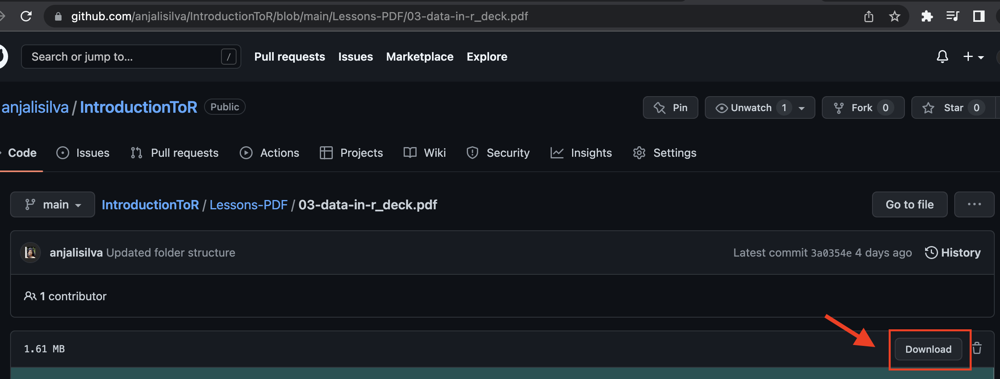

# Introduction To R

Welcome! The vast amount of data produced by evolving information technology requires tools and skills. Among the many tools, R is a free, open-source language and an environment that could be used for data sciences. This course aims to cover topics in R and data science, with applications illustrated via RStudio. This course is part of the University of Toronto's Data Sciences Institute Professional Programming.

## Contents
1. [Description](https://github.com/anjalisilva/IntroductionToR#description)
2. [Learning Outcomes](https://github.com/anjalisilva/IntroductionToR#learning-outcomes)
3. [Course Contacts](https://github.com/anjalisilva/IntroductionToR#course-contacts)
4. [Delivery Instructions](https://github.com/anjalisilva/IntroductionToR#delivery-instructions)
5. [Course Notes](https://github.com/anjalisilva/IntroductionToR#course-notes)
6. [Materials](https://github.com/anjalisilva/IntroductionToR#materials)
7. [Schedule](https://github.com/anjalisilva/IntroductionToR#tentative-schedule)
8. [Marking Scheme](https://github.com/anjalisilva/IntroductionToR#marking-scheme)
9. [Course Policies](https://github.com/anjalisilva/IntroductionToR#course-policies)

# Course Overview

## Description
The first part of this course teaches R with a focus on manipulating and visualizing data. Learners will get set up with a functional RStudio workflow, use different file types, transform data tables, import and manipulate data, use functions and loops, create data visualizations, make a Shiny app, and learn how to solve problems with their programming. Both base R and tidyverse methods are taught. To work reproducibly, learners will create R Projects. The second part of the course will cover the ethics of consent, Equity, Diversity & Inclusion (EDI) training, and professional skills including presentation, project management, and data security. Finally, the course will conclude with an industry case study. This course is designed for learners who have a degree in something other than Computer Science/Statistics who are looking to enhance their data science skills for their career.  

## Learning Outcomes
Learners will know how to:
  1. Comfortably access R, identify options for working with R, layout the purpose of using RStudio and R Projects, understand best R coding practices, and recognize where R stands among other data science tools. Further, learners will be able to navigate RStudio to write scripts, use different R data types and structures, use built-in R commands and accessing external functions via downloading R packages. This will be assessed in Assessment 1.
  2. Describe and define features of a dataset by applying manipulation and wrangling techniques. Learners will be able to access built-in R datasets and import external datasets into R to identify and describe data structures, apply manipulation techniques to reshape the datasets, detect missing values, clean data, summarize data, export data and report findings. This will be assessed in Assessment 2.
  3. Explain the strengths and limitations R workflows and analyses using concepts of reproducibility, bias, diversity, inclusion, ethical considerations, equity concepts, data security and best coding practices. This will be assessed in Assessment 2.
  4. Build a strategy for exploring data by designing functions that can take data as input, perform simple analyses, and generate exploratory plots as appropriate for data type and story to be told. This will be assessed in Assessment 2.

# Logistical Information

## Course Contacts
-   Instructor for this course is [**Anjali Silva**](https://anjalisilva.github.io/), PhD (she/her).
For emails to the instructor, use a.silva@utoronto.ca. Must use the subject line DSI-IntroR. E.g., DSI-IntroR: Inquiry about Lecture I. Response times: Week day: 48h and Weekends: 48h - 72h.

-   Teaching Assistant (TA) for this is **Jessie Wang**, PhD student (she/her).For emails to the TA, use jae.wang@mail.utoronto.ca.

## Delivery Instructions
-   The course will be held over a period of 3 weeks, with classes taking place 3 days a week. Format will be online - synchronous via Zoom. All course material will be available via [IntroductionToR](https://github.com/anjalisilva/IntroductionToR) GitHub repository. If you experience issues with joining the live lectures, you must email TA and copy Instructor. Include the issue description, time, date (screenshot if available) to avoid loss of participation marks. Due to unavoidable circumstances, if the live (synchronous) lecture is disrupted or cannot be held, the instructor will upload the recording with an email announcement. It is the responsibility of the learners to view the recording.

## Course Notes
-   All course material will be available via [IntroductionToR](https://github.com/anjalisilva/IntroductionToR) GitHub repository. 
Folder structure is as follows:

     * **Assessments**:  
     This folder contains assessment files for learners.
     * Lessons-AllFiles:  
     This folder contains all files (Rmarkdown, slide-html, slide-PDFs, images, data, etc.) and is designed for the instructor. 
     * **Lessons-Data**:  
     This folder contains data only and is designed for the learners. Learners should download and copy this folder as 'data' folder within their R Project.
     * **Lessons-PDF**:  
     This folder contains slide-PDFs only and is designed for the learners. Learners should download the slides. Slides should be referenced before class to prepare or after class to review. During class, there will be mostly live-coding. The end of each slide deck will contain homework for that particular lesson. It is highly recommend that learners attempt these and attend tutorial sessions to seek help.
     * Lessons-Rscripts:  
     This folder contains R scripts used by the instructor. It will be udpated after each class and learners may download it for reference. 
     * Teaching-Notes:  
     This folder contains lesson plans only and is designed to guide the instructor.
     * README: README file.
     * .gitignore: List of files to ignore specified by instructor.
     
## Materials
* **Learners must have internet connection, and a computer with administrative privileges, a microphone, and all required software installed in order to participate in online activities.** 
* **Learners must have R (http://www.r-project.org/). We will help with downloading.**
* **Learners must have RStudio (http://www.rstudio.com/). We will help with downloading.**
* **GitHub account (https://github.com/).**
* Screen space can be a limitation during online learning since you'll want to see the instructor's screen and have your RStudio open so that you can type along. If you have access to a second monitor or a larger tablet to attend the course while keeping your laptop screen available for coding - this would be great! If not - don't worry, we'll manage!
* Key texts: General reference
    *  Wickham and Grolemund, 2017, *R for Data Science*, O'Reilly. https://r4ds.had.co.nz/ 
    *  Alexander (eds), 2021, *DoSS Toolkit*, https://rohanalexander.github.io/doss_toolkit_book/  
* Key texts: For specific topics
    * Alexander, 2022, *Telling Stories with Data*, CRC Press. https://www.tellingstorieswithdata.com/ 
    * de Graaf, 2019. *Managing Your Data Science Projects: Learn Salesmanship, Presentation, and Maintenance of Completed Models*, Apress.
    * Healy, 2018. *Data Visualization*: A Practical Introduction, Princeton University Press
    * Timbers et al., 2021. *Data Science: A First Introduction*. https://ubc-dsci.github.io/introduction-to-datascience/ 
    * Wickham, 2021. *Mastering Shiny*, O'Reilly. https://mastering-shiny.org/ 
    * Wiley, Matt, Wiley, Joshua F., 2020. *Advanced R 4 Data Programming and the Cloud*
    * *Using PostgreSQL, AWS, and Shiny*, Apress.

## Schedule*
*Schedule may be modified as needed, and learners will be informed. Course will be taught using R version 4.2.1 and RStudio Desktop version 2022.02.3. All times in Eastern Standard Time (EST). Tutorials will be lead by the TA. 

| Date                                  	| Topics, Learning Goals, and Course Slides                                                                                                                                                                                                                                                                                                                                                                                                                                                                                                        	|
|---------------------------------------	|-----------------------------------------------------------------------------------------------------------------------------------------------------------------------------------------------------------------------------------------------------------------------------------------------------------------------------------------------------------------------------------------------------------------------------------------------------------------------------------------------------------------------------------	|
| Monday   7 November    Tutorial   5pm-6pm    Class   6pm-8pm      	| **Hello world and work practices**   - Data science tools, why R, options for working with R, and citing R. - Downloading R, RStudio, its anatomy and navigating RStudio environment. - Layout best R coding practices.  - Understand importance of reproducibility and working with R Projects.  - Identify components of a reprex. - Identify R syntax, how to get help, and use of built-in functions. - Perform mathematical operations in R.  - Learn how to install R packages (CRAN, Bioconductor, GitHub). - Identify different file types and diagnosing of errors.   - 00-introduction_deck.pdf   - 01-hello-world_deck.pdf  - 02-work-practices_deck.pdf  	|
| Thursday  10 November    Tutorial   5pm-6pm    Class   6pm-8pm  	| **Data in R (tibbles, strings, factors, times, missing values)**  - Understand tidyverse package and applications. - Understand differences in R data types and structures. - Become aware of data subsetting techniques.  - Be able to mix data types; distinguish between explicit and implicit coercion.  - Perform pattern-matching and string manipulation. - Be able to work with date-time data and categorical data. - Learn how to detect and work with missing values.   - 03-data-in-r_deck.pdf                                	|
| Saturday  12 November    Tutorial   8:30am-9am   noon-12:30pm    Class   9am-noon 	| **Manipulation (filtering; arranging; selecting; mutating, pipe; grouping; summarize)**  - Be able to upload datasets by recognizing file extensions and suitable functions. - Manipulate tabular data with dplyr: A Grammar of Data Manipulation. - Apply manipulation techniques for data cleaning and summarization.  - Use of manipulation techniques for reshaping data for user needs.   - 04-manipulation_deck.pdf                                                                                                                           	|
| Monday  14 November    Tutorial   5pm-6pm    Class   6pm-8pm    	| **Wrangling (importing data; pivot, joining data; data.table)**  - Recognize functions for importing different file types. - Be aware of tidy data rules and limitations.  - Be able to generate toy datasets and utilize datasets from R packages. - Perform different joins and distinguish between mutating/filtering joins. - Understand garbage collection system in R.  - Be able to determine the memory usage of R sessions. - Identify memory efficient methods of working with large datasets.   - 05-wrangling_deck.pdf       	|
| Thursday  17 November    Tutorial   5pm-6pm    Class   6pm-8pm  	| **Industry case study**  - speaker: Nicholas Mitsakakis, PhD, P.Stat.                                                                                                           	|
| Saturday  19 November    Tutorial   8:30am-9am   noon-12:30pm    Class   9am-noon 	| **Programming (custom functions, loops, if/else logic, purr, simulations)**  - Identify components and requirements of writing functions. - Understand function structure: arguments, return values and default values. - Learn flow control: for/while loops and conditional statements.  - Identify use of functional programming tools for iterations. - Learn to simulate data, randomization and sampling.   - 06-programming_deck.pdf                                                                                                   	|
| Monday  21 November    Tutorial   5pm-6pm    Class   6pm-8pm    	| **Visualization (initialization, choosing chart types, ggplot, customizing)**   - Become familiar with grammar of graphics. - Learn to initialize a plot, add aesthetics and layers. - Identify how to customize plots with title, labels, axis, theme, size and fills.  - Be able to work with colour choices and use of legends.  - Become familiar with different visual effects and impact on story telling.  - Consider accessibility principles for visualizations.   - 07-visualization_deck.pdf                                                                                               	|
| Thursday  24 November    Tutorial   5pm-6pm    Class   6pm-8pm  	| **Shiny applications; Ethics, inequity and professional skills**  - Learn how to use and make simple interactive web applications from R. - Learn how to use prebuilt output widgets for displaying plots and tables. - Understand ethical considerations in data science work.  - Recognize EDI practices and their importance in data sciences. - Identify professional skills including presentation, project management, and data security.   - 08-shiny_deck.pdf  - 09-ethics_deck.pdf  - 10-inequity_deck.pdf  - 11-professional-skills_deck.pdf                                                                                                                                                                                                                                                                                                                                                                                                                                                                                                  	|
| Saturday  26 November    Tutorial   8:30am-9am   noon-12:30pm    Class   9am-noon 	| **R: Review and Practice**                                                                                                                                                                                                                                                                                                                                                                                                                                                                                                            	|

# Marking Scheme
| Item                                            	| Weight 	| Purpose and Document Name                                                                                                                                                                                                                                                                                                                                                                                                                             	| Deadline                                                              	|
|-------------------------------------------------	|--------	|-------------------------------------------------------------------------------------------------------------------------------------------------------------------------------------------------------------------------------------------------------------------------------------------------------------------------------------------------------------------------------------------------------------------------------------------------------	|-----------------------------------------------------------------------	|
| 00 Pre-course assessment: R/RStudio setup 	| 0%     	| Proper setup of R and RStudio, prior to class with the TA. Attendance is optional, but  highly recommended to ensure you have proper  setup of R and/or RStudio.    Document: 00_PrecourseAssignment.pdf                                                                                                                                                                                                                               	| 7 November  2022 before  5.50 pm EST                            	|
| 01 Class  attendance                         	| 10%    	| Encourage active participation of all attendees  in class activities and discussions. Class  attendance is mandatory. Ensure you join  Zoom using the name provided in course as  TA will be marking your attendance. If you are  unable to attend class, it is your responsibility to  make-up the work that was covered. Tutorial  attendance is optional, but highly recommended. 	| Ongoing; 7 November to 26 November, 2022 from 6pm-8pm EST;  or 9am-12noon 	|
| 02 Assessment 1 problem set                  	| 45%    	| A problem set based on R basics, navigating  RStudio, data types and structures, R coercion rules, using built-in functions, working with missing values, use of external functions by downloading R packages, and string manipulation.   Document: 02_Assessment1.pdf                                                                                                                                                                                                   	| 20 November  2022, 9.00 pm EST                                  	|
| 03 Assessment 2 problem set                  	| 45%    	| A problem set based on data reshaping techniques and tidyverse R package, including application of  data manipulation, wrangling, functional programming  and data visualization. There will be questions on best  R coding practices and EDI practices in data science.   Document: 03_Assessment2.pdf                                                                                                                                                                 	| 29 November 2022, 9.00 pm EST                                   	|

# Course Policies

## During Class
-   The course will include mainly live-coding classes. Learners are expected to follow along with the coding. Be mindful of online fatigue. Be respectful and only one speaker at a time. Use name provided in the course when participating in Zoom. You may use chat or microphone to ask questions. Keep microphones muted, unless you need to speak. Use raise hand feature, and indicate your name before speaking. Keeping your video on is optional, however, if you choose to leave it on, be mindful of what your peers can see. Course communications will take place via email. Learners with diverse learning styles and needs are welcome in this course. 

## Assignment Submission Policy
-   See above for assessment weights, deadlines and guidelines. All assessment submissions must be done via email, unless stated otherwise. When submitting assessment files, label using this format: LASTNAME_FirstInitial_Assessment.format. E.g., SILVA_A_A1.PDF. Instructions of each assessment will specify the ‘Assessment’ name and format. Students must follow this label format. The student is responsible for emailing correct files on time, in the format specified.

## Late Penalty Policy
-   10% of the mark will be deducted for each day late, up to 30%. Assignments will NOT be accepted after three days. Be sure to plan well in advance.

## Academic Integrity and Honesty
-   In this course you are expected to follow full disclosure policy: If it’s not your own, new idea, it has a source. All sources must be referenced. For advice on how not to plagiarize, read: https://advice.writing.utoronto.ca/using-sources/, https://www.academicintegrity.utoronto.ca/, and https://guides.library.utoronto.ca/plagiarism. You are responsible for understanding University policies on academic integrity. 

## Keep Copies of Everything
-   Each student should keep all copies of any assessments submitted.

## Collaboration
-   While you are encouraged to discuss approaches to assessments with other students, the material turned in must be your own.

## Notice of Video Recording and Sharing (Download Prohibited; Reuse Prohibited)
-   This course, including your participation, may be recorded on video and will be available to students in the course for viewing remotely and after each session. Course videos and materials belong to your instructor, the University, and/or other sources depending on the specific facts of each situation and are protected by copyright. In this course, you are permitted to view session videos and materials for your own academic use, but you should not copy, share, or use them for any other purpose without the explicit permission of the instructor. For questions about the recording and use of videos in which you appear, please contact the instructor.

 

## Missed Class
-   Students who are absent from class for any reason (e.g., COVID, other illness or injury, family situation) and who require consideration for missed academic work should report their absence to instructor and TA, and discuss any needed consideration.

## Downloading Files
-   All course material will be available via [IntroductionToR](https://github.com/anjalisilva/IntroductionToR) GitHub repository. As per prerequisites outlined for the course, it will be assumed that learners are familiar with GitHub. If you are unsure how to download files from GitHub, you may visit the repository [link](https://github.com/anjalisilva/IntroductionToR) and click 'Code' and then 'Download zip' to download all files, as shown below (see red arrows 1 and 2):

  
  
-   Alternatively, to download individual files, e.g., 03-Data-in-R PDF slides only, visit the slide [link](https://github.com/anjalisilva/IntroductionToR/blob/main/Lessons-PDF/03-data-in-r_deck.pdf) and click the 'Download' button on top right side of page as shown below (see red arrow):

  
  
  
-   You may also read about [cloning a GitHub repository](https://docs.github.com/en/repositories/creating-and-managing-repositories/cloning-a-repository).

 

# Acknowledgements
-   Slides covered in the lectures were originally developed by Amy Farrow under the supervision of Rohan Alexander, University of Toronto. Slides have been modified by Anjali Silva for 2022.

- We wish to acknowledge this land on which the University of Toronto operates. For thousands of years it has been the traditional land of the Huron-Wendat, the Seneca, and most recently, the Mississaugas of the Credit River. Today, this meeting place is still the home to many Indigenous people from across Turtle Island and we are grateful to have the opportunity to work on this land.

## Maintainer
-   Anjali Silva (<a.silva@utoronto.ca>), University of Toronto.

## Contributions
-   `IntroductionToR` welcomes issues, enhancement requests, and other contributions. To submit an issue, use the [GitHub
issues](https://github.com/anjalisilva/IntroductionToR/issues).
